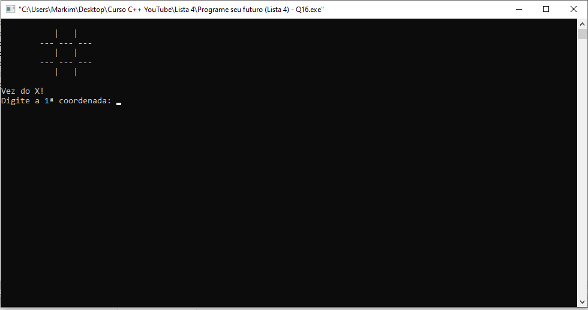
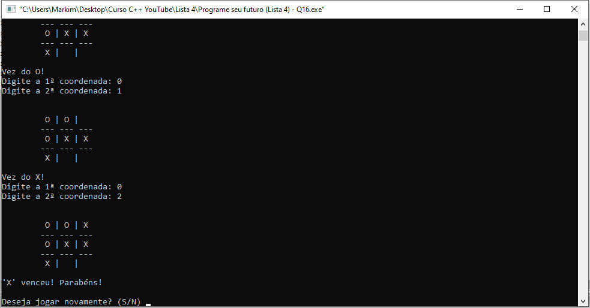

# TIC-TAC-TOE #

## Descrição do projeto

Desenvolvido em C++ por Marcos Beletato

## Como usar
    - 1ª coordenada corresponde à linha;
    - 2ª coordenada corresponde à coluna;
    - Jogo começa com o X e os jogadores se alternam à cada rodada;
    - Ao final do jogo digite 'S' para jogar novamente ou 'N' para não.

